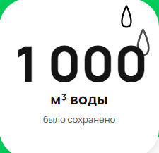
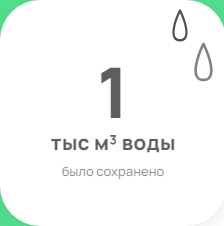
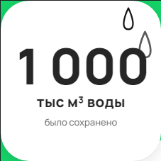
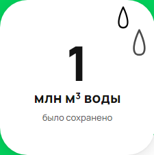

|ID|1|
| :- | :- |
|Заголовок|Наложение текста на счетчике электроэнергии при значениях счетчика >=1000000 кВт•ч|
|Описание|Если значение счетчика больше или равно 1000000 кВт•ч, то при отображении цифр происходит наложение текста “кВт•ч энергии” на текст “было сэкономлено”|
|Текущий результат ||
|Ожидаемый результат|Строка “кВт•ч энергии” должна размещаться на уровне строки “млн”|
|Приоритет |Low|
|Серьёзность|Minor|
|Окружение|
ОС: Windows 10

Браузер: Яндекс браузер 24.1.5.736 (64-bit)
|

|ID|2|
| :- | :- |
|Заголовок|Неверное отображение числа 999500 при округлении на счетчике воды|
|Описание|Происходит неправильное отображения числа и текста при округлении значения счетчика |
|Текущий результат ||
|Ожидаемый результат||
|Приоритет |Low|
|Серьёзность|Trivial|
|Окружение|
ОС: Windows 10

Браузер: Яндекс браузер 24.1.5.736 (64-bit)
|

|ID|3|
| :- | :- |
|Заголовок|Неверное отображение числа 999500000 при округлении на счетчике воды |
|Описание|Происходит неправильное отображения числа и текста при округлении значения счетчика|
|Текущий результат ||
|Ожидаемый результат||
|Приоритет |Low|
|Серьёзность|Trivial|
|Окружение|
ОС: Windows 10

Браузер: Яндекс браузер 24.1.5.736 (64-bit)
|

